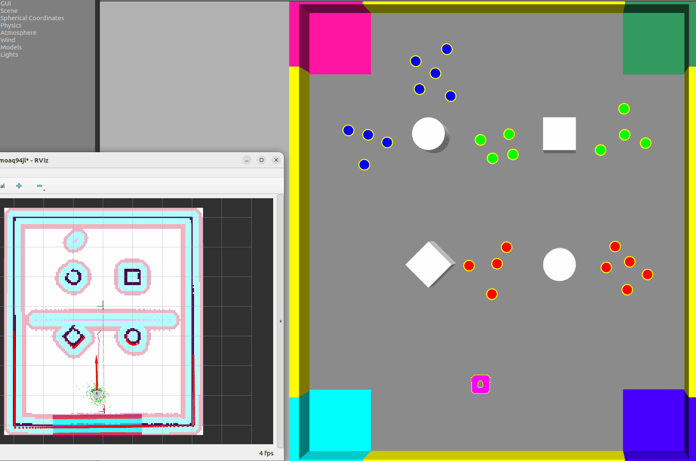
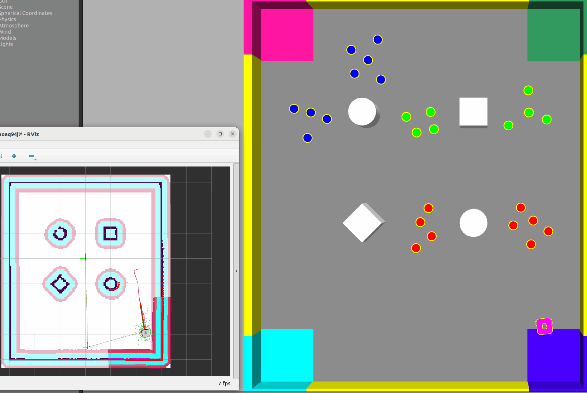

<br />

<p align="center">
  <a href="https://github.com/chenglun11/AURO_final/">
    
  </a>

<h3 align="center">Nav2Robot </h3>
  <p align="center">Nav2Robot is a solution to the finial Assessment of AURO at University of York 2024-2025-M</p>
  <p align="center">
    <br />
    <a href="https://github.com/chenglun11/AURO_final/blob/main/README.md"><strong>Explore this document »</strong></a>
    <br />
    <br />
    <a href="#demo">Demo</a>
    ·
    <a href="https://github.com/chenglun11/AURO_final/blob/main/README_cn.md">简体中文[ZH-CN]</a>
    ·
    <a href="https://github.com/chenglun11/AURO_final/issues">Report Bug</a>
    ·
    <a href="https://github.com/chenglun11/AURO_final/issues">Commit a Feature</a>

</p>

</p>

TOC

- [Demo](#demo)
- [Requirements](#requirements)
- [Getting Started](#getting-started)
- [Catalog description](#catalog-description)
- [Arguments](#arguments)
  - [How to use arguments](#how-to-use-arguments)
  - [Arguments list](#arguments-list)
- [Version Control](#version-control)
- [Author](#author)
- [License](#license)
- [Contributors](#contributors)

### Demo

1. Initialize the robot and acting
   
2. Find another target
   

### Requirements

1. [ROS2 Humble](https://docs.ros.org/en/humble/index.html)
2. [ROS2 Navigation2](https://docs.nav2.org/#)
3. [Gazebo Classic Version 11](https://gazebosim.org/home)
4. [RViz](http://wiki.ros.org/rviz)
5. Ubuntu 22.04 `forced`
6. Tf_transforms


### Getting Started

1. install Requirements

```bash
sudo apt install ros-humble-tf-transformations
```

1. Clone the repo `Will available soom`

```bash
git clone https://github.com/xxxxx/AURO_final.git
```

3. Build

```bash
colcon build
```

4. Source Code

```bash
source /path/install/local_setup.bash
```
5. Common use
``` bash
ros2 launch solution solution_nav2_launch
```
6. Examples
``` bash
ros2 launch solution solution_nav2_launch num_robot:=1
```

**More launch arguments see** [Arguments](#arguments)

### Catalog description

```
filetree 
├── /solution/
│  ├── /config/
│  │  ├── custom_rviz_windows.yaml #rviz config
│  │  └── initial_poses.yaml #pose config
│  ├── /solution/
│  │  ├── ZoneManager.py #zone controller
│  │  ├── robot_controller.py #main controller
│  │  ├── data_logger.py  #goal value logger
│  │  └── __init__.py
│  ├── /launch/
│  │  ├── solution_launch.py  #launch without nav2
│  │  └── solution_nav2_launch.py #launch within nav2
│  ├── /params/
│  │  └── custom_nav2_params_namespaced.yaml #Nav2 config
│  ├── /test/
│  │  ├── test_copyright.py
│  │  ├── test_flake8.py
│  │  └── test_pep257.py
│  ├── package.xml  #package detail
│  ├── setup.cfg
│  └── setup.py #setup
├── LICENSE
└── README.md 

```
**The rqt Graph**


**TF Tree**

### Arguments

You could use `--show-args` to list all the arguments
#### How to use arguments
The basic usage of argument example is:
```bash
ros2 launch solution solution_nav2_launch Argument_name:data
```

#### Arguments list

- Change number of robots to spawn `default_value=1`
```bash
num_robots 
```
- Random number seed for item manager(For random item) `default_value=1`
```bash
random_seed 
```
- Experiment duration in seconds `default_value='300.0'`
```bash
experiment_duration
```
- Full path to directory where data logs will be saved `default_value=#package_path`
```bash
data_log_path
```
- Filename prefix to use for data logs' `default_value='data_log'`
```bash
data_log_filename
```
---

### Version Control

The project uses Git for version control. You can see the currently available versions in the repository.

### Author

The Author detail is currectly unavailable duo to the policy of exam.

*You can also see all the developers involved in the project in the contributors list.*

### License

1. Package solution：Copyright (c) 2024 xxxx with [MIT License](/LICENSE)
2. Package assessment: Copyright (c) 2024 University of York and others with ELP2.0

### Contributors

**Thanks for every contributor and related package author**

- Alan Millard - initial contributor
- [Pedro Ribeiro](https://github.com/pefribeiro) - revised implementation

