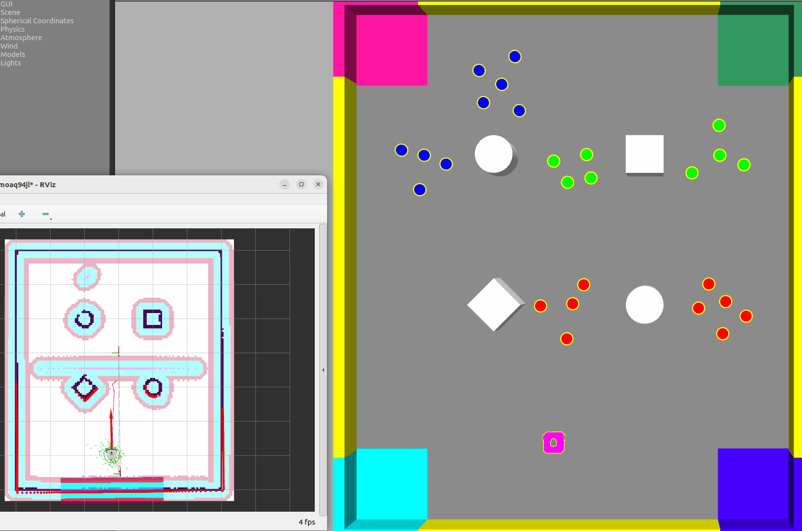

<!-- PROJECT SHIELDS -->

<!-- 


 -->

<!-- PROJECT LOGO -->

<br />

<p align="center">
  <a href="https://github.com/chenglun11/AURO_final/">
    
  </a>

<h3 align="center">Nav2Robot </h3>
  <p align="center">Nav2Robot 是一个关于约克大学AURO课程2024-2025-M结课作业的解决方案 </p>
  <p align="center">
    <br />
    <a href="https://github.com/chenglun11/AURO_final/blob/main/README.md"><strong>探索本文档 »</strong></a>
    <br />
    <br />
    <a href="#demo">示例</a>
    ·
    <a href="https://github.com/chenglun11/AURO_final/blob/main/README_cn.md">简体中文 [ZH-CN]</a>
    ·
    <a href="https://github.com/chenglun11/AURO_final/issues">报告 Bug</a>
    ·
    <a href="https://github.com/chenglun11/AURO_final/issues">探索新想法</a>
    
  </p>

</p>

TOC
- [示例](#示例)
- [项目依赖](#项目依赖)
- [快速开始](#快速开始)
- [项目文件树](#项目文件树)
- [Features](#features)
- [版本控制](#版本控制)
- [作者](#作者)
- [许可说明](#许可说明)
- [贡献者](#贡献者)


### 示例
- 初始启动 

- 寻找下个目标


### 项目依赖

1. [ROS2 Humble](https://docs.ros.org/en/humble/index.html)
2. [ROS2 Navigation2](https://docs.nav2.org/#)
3. [Gazebo Classic Version 11](https://gazebosim.org/home)
4. [RViz](http://wiki.ros.org/rviz)
5. Ubuntu 22.04 `强制`
6. Tf_transforms

### 快速开始
1. 安装依赖

```bash
sudo apt install ros-humble-tf-transformations
```

2. 克隆仓库 `Will available soom`

```bash
git clone https://github.com/chenglun11/AURO_final.git
```

3. 打包

```bash
colcon build
```

4. 导入

```bash
source /path/install/local_setup.bash
```

### 项目文件树

```
filetree 
├── /solution/
│  ├── /config/
│  │  ├── custom_rviz_windows.yaml #rviz config
│  │  └── initial_poses.yaml #pose config
│  ├── /solution/
│  │  ├── robot_controller.py #main controller
│  │  ├── data_logger.py  #goal value logger
│  │  └── __init__.py
│  ├── /launch/
│  │  ├── solution_launch.py  #launch without nav2
│  │  └── solution_nav2_launch.py #launch within nav2
│  ├── /params/
│  │  └── custom_nav2_params_namespaced.yaml #Nav2 config
│  ├── /test/
│  │  ├── test_copyright.py
│  │  ├── test_flake8.py
│  │  └── test_pep257.py
│  ├── package.xml  #package detail
│  ├── setup.cfg
│  └── setup.py #setup
├── LICENSE
└── README.md 

```

### Features
1. 

### 版本控制
The project uses Git for version control. You can see the currently available versions in the repository.

### 作者
The Author detail is currectly unavailable duo to the policy of exam.

*You can also see all the developers involved in the project in the contributors list.*

### 许可说明
1. Package solution：Copyright (c) 2024 chenglun11 with [MIT License](https://github.com/chenglun11/AURO_final/blob/main/LICENSE)
2. Package assessment: Copyright (c) 2024 University of York and others with ELP2.0


### 贡献者

**感谢每一位贡献者和相关软件包作者**

- Alan Millard - initial contributor
- [Pedro Ribeiro](https://github.com/pefribeiro) - revised implementation
- [University Of York](https://york.ac.uk)
- [GitHub Pages](https://pages.github.com)
- [Animate.css](https://daneden.github.io/animate.css)
- [xxxxxxxxxxxxxx](https://connoratherton.com/loaders)

<!-- links -->

[your-project-path]: shaojintian/Best_README_template
[contributors-shield]: https://img.shields.io/github/contributors/shaojintian/Best_README_template.svg?style=flat-square
[contributors-url]: https://github.com/shaojintian/Best_README_template/graphs/contributors
[forks-shield]: https://img.shields.io/github/forks/shaojintian/Best_README_template.svg?style=flat-square
[forks-url]: https://github.com/shaojintian/Best_README_template/network/members
[stars-shield]: https://img.shields.io/github/stars/shaojintian/Best_README_template.svg?style=flat-square
[stars-url]: https://github.com/shaojintian/Best_README_template/stargazers
[issues-shield]: https://img.shields.io/github/issues/shaojintian/Best_README_template.svg?style=flat-square
[issues-url]: https://img.shields.io/github/issues/shaojintian/Best_README_template.svg
[license-shield]: https://img.shields.io/github/license/shaojintian/Best_README_template.svg?style=flat-square
[license-url]: https://github.com/shaojintian/Best_README_template/blob/master/LICENSE.txt
[linkedin-shield]: https://img.shields.io/badge/-LinkedIn-black.svg?style=flat-square&logo=linkedin&colorB=555
[linkedin-url]: https://linkedin.com/in/shaojintian
